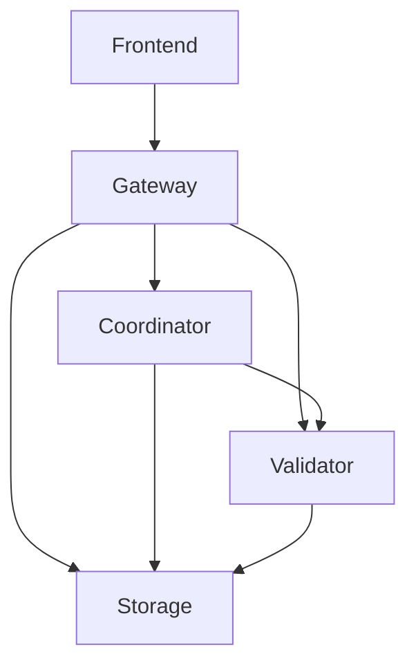

# SwamNeuro Services Guide

## Component Overview

1. **Gateway (Port 8080)**
   - Main API gateway
   - Handles request routing
   - Authentication & authorization

2. **Frontend (Port 3000)**
   - React application
   - User interface
   - Web3 integration

3. **Coordinator (Port 9000)**
   - Task distribution
   - Node management
   - Performance monitoring

4. **Validator (Port 9001)**
   - Result validation
   - Proof verification
   - Reward calculation

5. **Storage (Port 9002)**
   - Data persistence
   - IPFS integration
   - File management

## Starting Services

### Method 1: Individual Start

1. **Start Gateway**
   ```bash
   cd gateway
   npm run dev
   ```

2. **Start Frontend**
   ```bash
   cd frontend
   npm start
   ```

3. **Start Coordinator**
   ```bash
   cd src/coordinator
   node index.js
   ```

4. **Start Validator**
   ```bash
   cd src/validator
   node index.js
   ```

5. **Start Storage**
   ```bash
   cd src/storage
   node index.js
   ```

### Method 2: Using Start Script

```bash
node scripts/start-services.js
```

## Environment Configuration

Create `.env` file with:

```env
# Gateway
GATEWAY_PORT=8080
GATEWAY_HOST=localhost

# Frontend
PORT=3000
REACT_APP_GATEWAY_URL=http://localhost:8080

# Coordinator
COORDINATOR_PORT=9000
COORDINATOR_HOST=localhost

# Validator
VALIDATOR_PORT=9001
VALIDATOR_HOST=localhost

# Storage
STORAGE_PORT=9002
STORAGE_HOST=localhost
IPFS_NODE=localhost:5001

# Blockchain
WEB3_PROVIDER_URL=http://localhost:8545
CONTRACT_ADDRESS=your_contract_address
```

## Service Dependencies



## Health Checks

Monitor service health at:
- Gateway: http://localhost:8080/health
- Coordinator: http://localhost:9000/health
- Validator: http://localhost:9001/health
- Storage: http://localhost:9002/health

## Logs

Each service writes logs to:
```
logs/
  ├── gateway.log
  ├── coordinator.log
  ├── validator.log
  └── storage.log
```

## Common Issues

1. **Port Conflicts**
   - Check if ports are already in use
   - Update ports in .env file
   - Kill conflicting processes

2. **Service Dependencies**
   - Ensure IPFS daemon is running
   - Check blockchain connection
   - Verify database connection

3. **Memory Issues**
   - Monitor node memory usage
   - Adjust heap size if needed
   - Check for memory leaks

## Monitoring

Access service metrics at:
- Coordinator: http://localhost:9000/metrics
- Validator: http://localhost:9001/metrics
- Storage: http://localhost:9002/metrics

## Development Mode

For development, use:
```bash
# Terminal 1 - Gateway
npm run dev:gateway

# Terminal 2 - Frontend
npm run dev:frontend

# Terminal 3 - Services
node scripts/start-services.js
```

## Production Mode

For production:
```bash
# Build all services
npm run build

# Start production server
npm run start:prod
```
